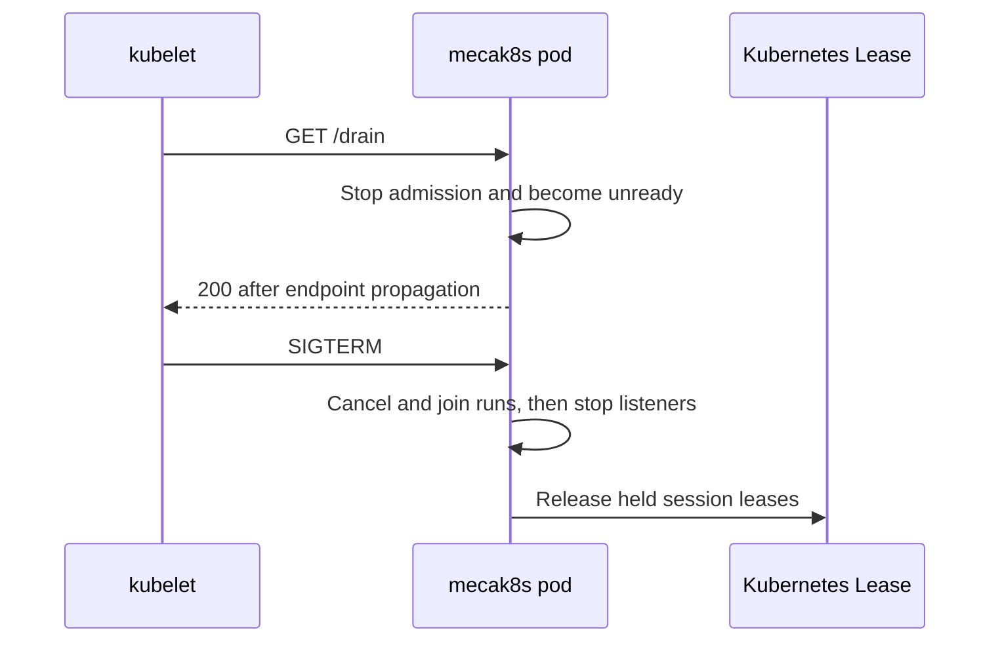

# Scale, recover, and upgrade mecak8s

Plan routing and durable storage before adding replicas. Verify recovery with your gateway and Redis topology after a deployment change.

## Installation telemetry identity

The chart stores a non-secret installation UUID in a ConfigMap. Live Helm
upgrades preserve an automatically generated ID with `lookup`, but uninstalling
the release removes it. Set a canonical lowercase UUID explicitly for GitOps or
to preserve the ID across reinstall:

```yaml
telemetry:
  installationID: 123e4567-e89b-12d3-a456-426614174000
```

Changing the value rolls the Deployment, and OpenTelemetry exports it as the
`mecatl.installation.id` resource attribute. To rotate an automatically
generated ID, make the new UUID explicit during an upgrade:

```sh
NEW_ID="$(uuidgen | tr '[:upper:]' '[:lower:]')"
helm upgrade <RELEASE> oci://ghcr.io/stacklok/mecatl/charts/mecak8s \
  --version <VERSION> --namespace <NAMESPACE> --reuse-values \
  --set-string telemetry.installationID="$NEW_ID"
```

## Use workload identity for an LLM gateway

Edge-terminated h2c sends the caller's bearer token across the pod network in
cleartext. Restrict the Service to gateway pods with NetworkPolicy or an mTLS
mesh. The chart does not verify the gateway or provide a general NetworkPolicy.

The gateway must forward the original bearer token and expose only the gRPC
route. Do not publish `/drain`, `/healthz`, or `/readyz`. The chart creates no
Gateway, Route, Certificate, or `BackendTLSPolicy`; configure those resources or
retain in-pod TLS for re-encryption. Move an existing in-pod TLS release to h2c
through a blue-green or maintenance cutover.

For an OpenAI-compatible gateway that trusts Kubernetes workload identity, use
the chart's existing `extraArgs`, `extraVolumes`, and `extraVolumeMounts` to
project a ServiceAccount token and pass an explicit gateway base URL with the
bearer file:

```yaml
extraArgs:
  - --openai-base-url=https://llm-gateway.example.com/v1
  - --openai-bearer-token-file=/var/run/secrets/llm-gateway/token
extraVolumes:
  - name: llm-gateway-token
    projected:
      sources:
        - serviceAccountToken:
            path: token
            audience: api://mecak8s-llm-gateway
            expirationSeconds: 600
extraVolumeMounts:
  - name: llm-gateway-token
    mountPath: /var/run/secrets/llm-gateway
    readOnly: true
```

`mecak8s` reads the file before every OpenAI request, so token rotation is
automatic. Bearer-file mode requires an explicit, nonempty `--openai-base-url`
and never defaults to `api.openai.com`. The base URL must use HTTPS unless it
targets loopback development, and redirects are refused.
`--openai-bearer-token-file` is mutually exclusive with `OPENAI_API_KEY`.

Choose the gateway's exact audience instead of the default Kubernetes API
audience. Configure the gateway to trust the cluster issuer, that audience, and
the exact `system:serviceaccount:<namespace>:<serviceaccount>` subject.

## Session affinity is an infrastructure contract

Official clients send `X-Mecatl-Session-ID` on session-bound gRPC and HTTP
requests when the ID is printable ASCII without surrounding spaces. Duplicate,
malformed, and mismatched values are rejected. Existing clients may omit it.
Gateways can use this active-session field for consistent routing, but the
Kubernetes session lease remains the ownership authority.

Outbound model requests also carry `X-Mecatl-Root-Session-ID`. The root field
stays constant across a main run's subagents, Parallel branches, team members,
and delegated-model routing, while `X-Mecatl-Session-ID` identifies the active
child session. Provider logs can therefore group delegated work by its main
conversation without losing child-level attribution. The root field is outbound
only and must not be used for gateway affinity.

Both fields are correlation metadata. They grant no authentication,
authorization, ownership, fencing, idempotency, or cache authority. Lease loss
blocks new state mutations on the stale pod, although an already admitted
external call can finish. A pending approval stays durable for the successor.

Closing a live running or awaiting session fails precondition and does not
release its lease. During shutdown, Mecatl stops admission, preserves pending
approvals, settles runs, then releases ownership. If the deadline expires, the
lease remains until process death or TTL expiry. After a handoff, the client
retries; external model and tool effects are not exactly once.

The chart does not create gateway or session-affinity resources. Its `affinity`
value controls Kubernetes pod scheduling only.

Before affinity rollout, validate that authenticated admission, request and
header-size bounds, and client, IP, and principal rate limits apply before or
independently of routing on attacker-controlled session IDs.

## Mount trusted skills, agents, and rules

Set `XDG_CONFIG_HOME` to the mount root, put files below
`<root>/mecatl/{skills,agents,rules}`, and set `skills.autoDiscover: true`
(default `false`) to discover skills from the standard XDG locations
(`$XDG_CONFIG_HOME/mecatl/skills` or `~/.config/mecatl/skills`, plus
`~/.claude/skills`) and, when the workspace is trusted,
`<workspace>/.mecatl/skills` and `<workspace>/.claude/skills`.

Create the referenced ConfigMap in the release namespace first:

```yaml
apiVersion: v1
kind: ConfigMap
metadata:
  name: mecatl-config-v1
  namespace: mecatl
immutable: true
data:
  review-skill: |
    ---
    name: review
    ---
    Review changes for correctness and security.
  reviewer-agent: |
    ---
    name: reviewer
    ---
    Review the supplied change and report actionable findings.
  base-rules: |
    Keep responses concise and explain material risks.
```

Then provide the matching Helm values:

```yaml
extraEnv:
  - name: XDG_CONFIG_HOME
    value: /etc/mecatl-config
skills:
  autoDiscover: true
extraArgs: [--no-user-model]
extraVolumeMounts:
  - { name: mecatl-config, mountPath: /etc/mecatl-config, readOnly: true }
extraVolumes:
  - name: mecatl-config
    configMap:
      name: mecatl-config-v1
      items:
        - { key: review-skill, path: mecatl/skills/review/SKILL.md }
        - { key: reviewer-agent, path: mecatl/agents/reviewer.md }
        - { key: base-rules, path: mecatl/rules/base.md }
```

Use a read-only mount and preferably an immutable ConfigMap. An immutable
ConfigMap cannot be updated: create a new versioned ConfigMap, update its
content and the Helm `configMap.name` reference, then run `helm upgrade`.
Mutable ConfigMap updates also require a Deployment rollout because discovery is
snapshotted at startup. `--no-user-model` is required when this XDG root is
read-only because the user model is writable. Setting `XDG_CONFIG_HOME` also
relocates `mecatl/settings.yaml`, `mecatl/soul.md`, and `mecatl/auth.yaml`
lookup, so account for those files explicitly.

On Kubernetes 1.36 or newer, a ToolHive-packaged skill can instead be mounted
straight from an OCI artifact. Its `SKILL.md` must be at the artifact root.
Mount each artifact at `<XDG_CONFIG_HOME>/mecatl/skills/<skill-name>` and keep
`skills.autoDiscover: true`:

```yaml
extraEnv:
  - { name: XDG_CONFIG_HOME, value: /etc/mecatl-config }
skills:
  autoDiscover: true
extraArgs: [--no-user-model]
extraVolumeMounts:
  - name: review-skill
    mountPath: /etc/mecatl-config/mecatl/skills/review
    readOnly: true
extraVolumes:
  - name: review-skill
    image:
      reference: registry.example/skills/review@sha256:<digest>
      pullPolicy: IfNotPresent
```

Image volumes are inherently read-only, and the pod's `imagePullSecrets` apply
to artifact pulls normally. Use a digest-pinned reference in production; it
remains immutable and `IfNotPresent` may safely use the node cache. A mutable
tag with `IfNotPresent` may also reuse cached content; use `Always` if every pod
start must resolve that tag from the registry. Mecatl snapshots skill metadata
and body at startup, so any artifact change requires pod recreation.

Verify a mounted skill in a real session; `GET /v1/skills` proves only metadata
discovery. A test skill that writes and reads a unique marker should produce
`Skill`, `Write`, and `Read` calls in that order, followed by the marker.

Use Helm 3.16 or newer when adding an image volume to an existing release. Older
clients can render the YAML but may not know the `image` field when they
calculate an upgrade patch.

## The Helm chart's topology

The chart creates these resources:

|Resource|Behavior|
|-|-|
|ServiceAccount, Role, and RoleBinding|Grants only the required Lease verbs.|
|Deployment|Runs two storage-free replicas by default; one replica is supported.|
|ConfigMap|Stores the non-secret installation UUID for telemetry.|
|ClusterIP Service|Exposes gRPC on 8080 and HTTP/SSE on 8081.|
|PodDisruptionBudget|Uses `maxUnavailable: 1` for two or more replicas and is omitted for one.|
|Raw-driver NetworkPolicy|Created only with OIDC and limits raw-driver ingress to agent pods.|
|Local Redis fixture|Created only by the disposable `values-kind.yaml` profile.|

The chart creates no namespace or general NetworkPolicy. Supply network policy
for your provider, MCP, Redis, identity-provider, and Kubernetes API traffic.

Deployment details:

- Two replicas use `RollingUpdate`, `maxSurge: 1`, and `maxUnavailable: 0`.
- Pods prefer separate nodes through a soft hostname topology-spread constraint;
  single-node clusters remain schedulable.
- `terminationGracePeriodSeconds` defaults to 60 seconds. The schema requires at
  least 44 seconds, the first whole second above the 43-second default shutdown
  budget.
- No PVC, no `--store-dir`. The only `volumeMount` is `/tmp` for the Go runtime
  and SSE buffering under `readOnlyRootFilesystem: true`.
- A `preStop` hook calls the Pod-only plaintext drain listener on port 8082 and
  waits about three seconds for endpoint propagation. Restrict direct Pod-IP
  access to that port.
- Pods run as non-root with privilege escalation disabled, all capabilities
  dropped, and `RuntimeDefault` seccomp.

With `replicaCount: 1`, a voluntary disruption can evict the only pod. Redis
preserves persisted sessions but cannot preserve availability.

## Graceful shutdown

The shutdown sequence on SIGTERM (or when the kubelet calls `GET /drain` via the
`preStop` hook) is:



The shutdown budget is 43 seconds: three seconds for endpoint propagation, 15
for run drain, 10 for gRPC, and five each for HTTP, resource closure, and
telemetry. The Helm `terminationGracePeriodSeconds` default is 60. Increase it
when you increase any runtime bound; the schema's 44-second minimum covers only
the defaults. If a bound expires, the server cancels in-flight runs; a successor
can recover them from Redis.

A surviving pod can acquire a gracefully released lease immediately. After a
hard stop, it must wait for the 30-second default lease TTL.

Long-running model calls are cancelled when the shutdown bound expires. The
successor recovers the session and previous `allow-always` decisions from Redis.

## Verify session failover

Use the disposable cluster from
[Try Mecatl on Kubernetes](/operating/kubernetes.md), which runs
two ready replicas without production authentication. Get both pod names and
forward the first pod's HTTP port:

```sh
POD_A=$(kubectl get pods -n mecatl -l app.kubernetes.io/component=agent -o jsonpath='{.items[0].metadata.name}')
POD_B=$(kubectl get pods -n mecatl -l app.kubernetes.io/component=agent -o jsonpath='{.items[1].metadata.name}')

kubectl port-forward -n mecatl "pod/$POD_A" 8081:8081 &
```

Create a session and send a prompt through pod A:

```sh
SESSION_ID=$(curl -s -X POST http://127.0.0.1:8081/v1/sessions \
  -d '{"mode":"default"}' | jq -r .session_id)

curl -s -X POST "http://127.0.0.1:8081/v1/sessions/$SESSION_ID/prompt" \
  -H 'Accept: text/event-stream' -d '{"text":"say hello"}' > /dev/null
```

Run this command before deleting pod A, then again after pod B returns 200, to
see the Lease holder change:

```sh
kubectl get lease --namespace mecatl --output wide
```

Delete pod A gracefully, then send another prompt through pod B:

```sh
kubectl delete pod -n mecatl "$POD_A"
```

```sh
kubectl port-forward -n mecatl "pod/$POD_B" 8082:8081 &

curl -s -X POST "http://127.0.0.1:8082/v1/sessions/$SESSION_ID/prompt" \
  -H 'Accept: text/event-stream' -d '{"text":"are you still there?"}'
```

The request returns 200 with the previous conversation intact.

For comparison, select the replacement pod, forward it, and then force-delete
the current holder:

```sh
POD_C=$(kubectl get pods -n mecatl \
  -l app.kubernetes.io/component=agent \
  --field-selector="metadata.name!=$POD_B,status.phase=Running" \
  -o jsonpath='{.items[0].metadata.name}')
kubectl wait -n mecatl --for=condition=Ready "pod/$POD_C" --timeout=120s
kubectl port-forward -n mecatl "pod/$POD_C" 8083:8081 &

kubectl delete pod -n mecatl "$POD_B" --force --grace-period=0

curl -i -X POST "http://127.0.0.1:8083/v1/sessions/$SESSION_ID/prompt" \
  -H 'Accept: text/event-stream' -d '{"text":"retry after hard failure"}'
```

Pod C returns 409 with `"leased by another process"` until the 30-second default
lease TTL expires. Retry the request after the TTL to confirm that it returns
200 with the previous conversation. Run `task e2e:k8s` for the scripted checks.

## Scaling

The chart defaults to two replicas for HA-oriented operation, but
`replicaCount: 1` is supported when lower resource usage and simpler session
routing are preferred. In single-replica mode there is no failover and the chart
omits the PDB, so voluntary eviction can interrupt service; Redis preserves
successfully persisted state, not availability.

Kubernetes Leases enforce one writer per session. A second pod receives HTTP 409
or gRPC `FAILED_PRECONDITION`. Lease renewal defaults to one-third of
`--session-lease-ttl`.

Session affinity is optional. A client that reaches a pod without the lease
receives 409 and retries another replica or waits for the current run.

For two or more replicas, the PodDisruptionBudget defaults to
`maxUnavailable: 1`, so voluntary disruptions remove at most one replica as the
Deployment scales. Set `podDisruptionBudget.maxUnavailable` to a non-negative
integer or percentage, or set `podDisruptionBudget.enabled: false` when another
operator owns disruption policy.

The default `topologySpreadConstraints` softly prefer separate
`kubernetes.io/hostname` values and therefore keep single-node clusters
schedulable. Production deployments can replace `ScheduleAnyway` with
`DoNotSchedule` and add a zone-level constraint when the cluster topology can
satisfy them. The chart also supports `affinity`, `nodeSelector`, and
`tolerations` values.

Use Redis Sentinel, Redis Cluster, or a managed service for production high
availability. The disposable in-cluster Redis fixture has one replica and no
persistence.

## Next steps

- [Maintain execution-provider state](/operating/mecak8s/execution-provider-lifecycle.md).
- [Observe deployment health](/operating/mecak8s/observe-and-troubleshoot.md).
