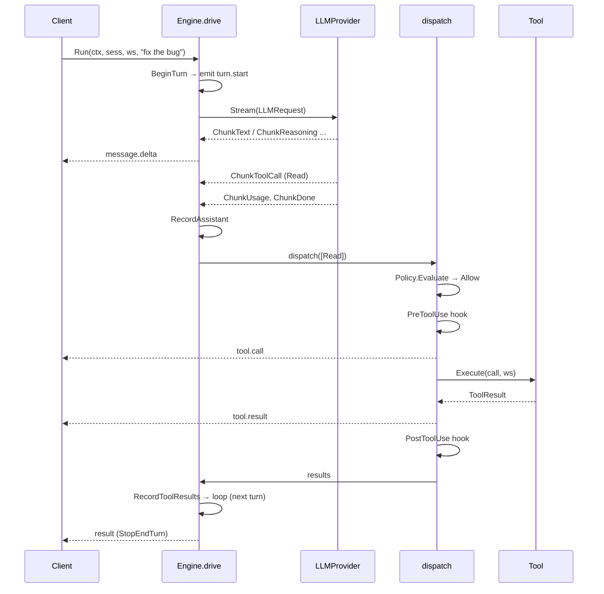
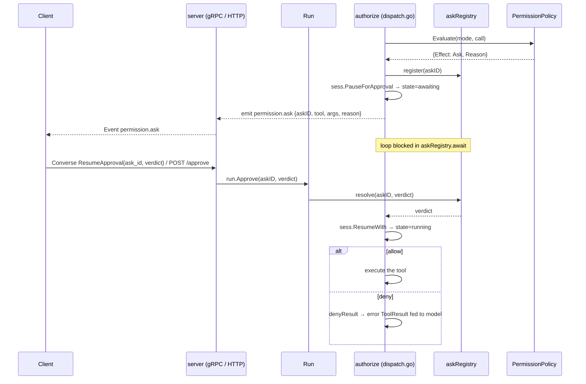

# The agent loop

When you call `Engine.Run`, the loop starts immediately in a background goroutine and returns a `*Run` handle. The goroutine drives turns — LLM call, tool dispatch, record, repeat — until the session reaches a terminal state. You do not poll or drive the loop yourself; you observe it through the event channel and send verdicts when the loop asks for approval.

---

## The event stream

`Run.Events()` returns a read-only channel that carries every observable event from the run. The channel is closed exactly once when the run terminates, so a simple `for event := range run.Events()` is all you need to follow a session from start to finish.

Events you will see, roughly in order:

| Event | When it fires |
|---|---|
| `session.init` | Once, before the first turn — the run has started |
| `turn.start` | Beginning of each LLM turn |
| `message.delta` | Streaming text fragments from the model |
| `tool.call` | A tool call is about to execute |
| `tool.result` | A tool finished and returned a result |
| `permission.ask` | The loop is paused waiting for your approval (see below) |
| `result` | Terminal event — carries cumulative usage and the stop reason |

The sequence for a single turn with one tool call looks like this:

---

## Turn structure

Each turn follows a fixed sequence:

1. **Check stop conditions.** Before calling the model, the loop checks whether the run should end: a prior stop reason, context cancellation, or the token budget (see below). If any condition is met, the run terminates cleanly.
2. **Maybe compact.** If the conversation is approaching the model's context limit, the loop compresses it before making the next call (see [Context limits & compaction](#context-limits--compaction)).
3. **Call the model.** The loop streams chunks from the LLM provider — text deltas, reasoning, tool calls, and usage metadata. Each text chunk emits a `message.delta` event.
4. **Dispatch tools.** If the model emitted tool calls, they are dispatched (see below). The results are recorded, and the loop continues to the next turn.
5. **End turn.** If the model returned no tool calls, the run is complete.

A tool error does not abort the run — it becomes an error result fed back to the model. The model can retry or choose a different path.

---

## Read-parallel / mutate-serial dispatch

When the model requests multiple tools in one turn, the loop processes them efficiently and safely:

- **Read-only tools run concurrently.** Within a maximal consecutive batch of read-only calls, all are authorized first (permission checks are still serialized, one at a time), then executed in parallel.
- **Mutating tools run alone.** A write operation — or any tool of unknown safety — runs serially, never overlapping another tool call.
- **Results are re-assembled in the original order** before being recorded.

This means a turn that reads five files runs them in parallel (fast), while a turn that edits a file is guaranteed not to overlap any other write (safe). You do not have to coordinate this yourself.

---

## Permission pause/resume

When a tool call requires human or policy approval, the loop pauses and emits a `permission.ask` event. The event carries an `askID`, the tool name, the arguments, and the reason the call was flagged.

Your client sends a verdict back to the run. Three outcomes are possible:

- **Allow once** — the tool executes this time; the policy does not learn a new rule.
- **Allow always** — the tool executes, and the policy learns a session-scoped allow rule so the same pattern will not ask again in this session.
- **Deny** — a permission-denied error result is fed back to the model. The model can adapt.

Deny is the safe default: an abandoned ask (e.g. from a crashed client) always fails closed.

The handshake is designed so a verdict that races in before the loop has started waiting is never lost — the loop registers the resolution channel before emitting the event.

On the wire: the gRPC `Converse` stream carries the verdict in a `ResumeApproval` frame on the same stream as events — no out-of-band correlation needed. The HTTP surface uses `POST /v1/sessions/{id}/approve`. Both land on `Run.Approve`.

---

## Context limits & compaction

mecatl manages the model's context window automatically. Before each turn, it estimates the token cost of the current conversation. If the conversation is approaching the limit (by default, 80% of the model's context window), the loop compresses it before making the next call.

Two compaction strategies ship out of the box:

- **Heuristic compactor** (default): preserves the goal and recently touched file paths, truncates large tool bodies, keeps the most recent messages.
- **Cascade compactor** (`--compaction=cascade`): works in cheapest-first tiers — snip → strip tool bodies → collapse large file contents → summarize — stopping as soon as the slice fits the budget. Its trigger and target use separate thresholds (hysteresis) so it doesn't thrash — compact once, then stay quiet until usage climbs back to the trigger ratio, rather than re-compacting on every turn near the edge.

Both strategies guarantee:

- The **most-recent user instruction** is never dropped into the summarized head. The first genuine user message stays pinned, and the compactor back-snaps the kept tail to include recent user turns verbatim.
- The **kept tail never starts on an orphaned tool result**. A tool result whose matching call was compacted away causes a provider error; the compactor always snaps forward past any such orphans.
- If the compacted slice is still invalid (orphaned pairs), the compactor **aborts and keeps the original history** rather than emit a broken conversation.

You do not interact with compaction directly. It fires automatically and the run continues.

### Where "the model's context window" comes from

The 80%-of-window trigger above needs an actual number to be 80% of, and that number isn't always known up front. mecatl resolves it in this order: an explicit override, then a live provider-reported window, then the embedded model catalog, then a 128k floor for a model it's never heard of. It resolves this **live, at the point of use** — not once at session start — so a background catalog refresh that lands mid-session takes effect on the very next check without restarting anything.

The operator escape hatch is `--context-window-override` (`mecated`/`mecatui`, default off): pin a specific token count when a provider under-reports its own window or sits behind a proxy that does. It moves both the compaction trigger and (in `mecatui`) the context-meter denominator together — a small override value makes the agent compact on nearly every turn, which is useful for stress-testing compaction but not much else.

In `mecatui`, the context meter's denominator can briefly show as unresolved (`ctx 40K`, no bar) right after a session starts on a model whose window the live catalog hasn't reported yet. This is expected and self-heals: once the live refresh lands, the bar fills in on its own without you doing anything.

### Token budget

You can bound the total token spend for a run with `MaxRunTokens`. This is checked at the turn boundary — never mid-stream, so an in-flight turn always completes — against the session's accumulated input and output tokens (cache tokens are excluded).

When the budget is crossed, the run ends cleanly with stop reason `budget`. That is a non-error terminal: the session is in `completed` state and can be reopened to continue. Every child run — subagent, parallel branch, team member — inherits the same budget. A per-call override can only tighten it, never raise it.

:::note[Default]

`MaxRunTokens` defaults to `0`, which means no limit. Enable it explicitly if you want cost control per run.

:::

---

## Cancellation & terminal states

Every run ends in exactly one of three terminal states:

| State | Meaning |
|---|---|
| `completed` (stop reason `end_turn`, `budget`, `no_progress`, `max_turns`) | The model or a limit ended the run cleanly |
| `cancelled` | `Run.Cancel()` was called, or the context was cancelled |
| `failed` | An unrecoverable error (e.g. the LLM provider returned an error that exhausted retries) |

`Run.Cancel()` cancels the run's context. The loop detects the cancellation at the next turn boundary or mid-dispatch and ends as `cancelled`. A cancelled run can be interrupted and restarted — orphaned in-flight tool calls are closed out with synthetic error results so the conversation stays consistent on restart.

### Restarting a session

A session that ends in any terminal state can be re-entered:

- **Completed** → `Reopen` moves it back to idle; you can submit a new prompt.
- **Cancelled** → `Interrupt` closes out orphaned tool calls, then moves to idle.
- **Failed** → `Recover` repairs the conversation and moves to idle, so a retry is *possible* — not guaranteed. If the failure had a permanent cause (a bad prompt, a persistently misconfigured provider), the retried run just fails cleanly again. When the server knows the failure was permanent (a 4xx rejection other than 408/429, a context-window overflow), mecatui shows a one-line summary block that names the error and plainly says retrying won't help — start a new session or change the request. A recover-notice warning appears once before the first turn so you see it before burning another provider call.

The service layer handles this automatically when you submit a new prompt to a session. You do not call these methods directly in normal operation.

---

## What's next

- [Permissions & guardrails](permissions.md) — how the permission rule engine and model-based guardrails work.
- [Hook system](hooks.md) — lifecycle hooks that fire before and after tool calls, prompts, and sessions.
- Extension points — implement a port interface to replace any capability (LLM provider, session store, permission policy) without touching the loop.
